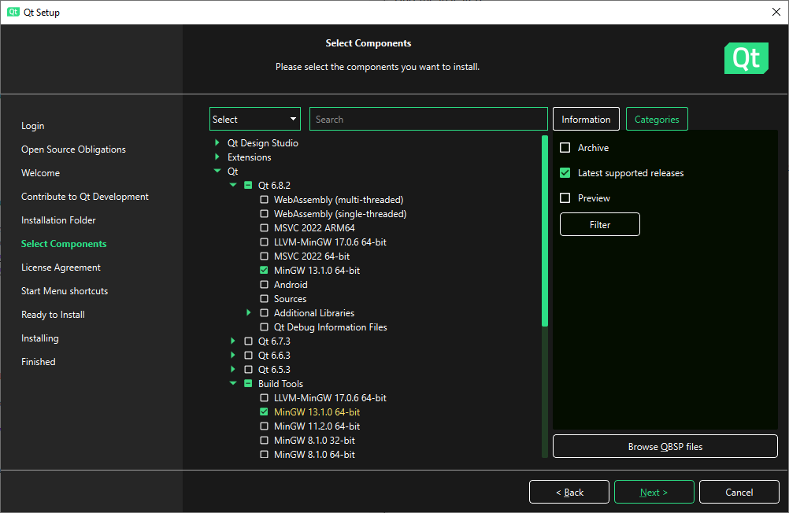
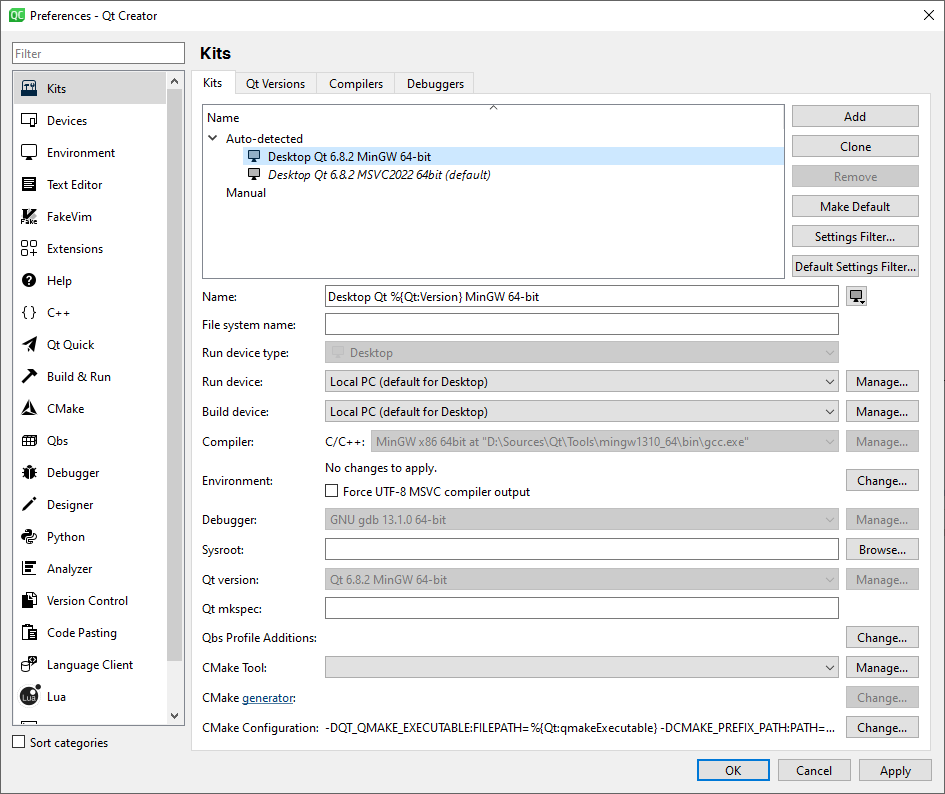

# How to build (and further develop) this application


First half of this page provides instructions how to build this application from source codes using only minimal tooling with as small footprint as possible.
The second half describes how you can start actively developing the application, adding new features, improving compatibility and so on.

To get started, you generally need these things:
1. C++ build tools (compiler: GCC, Clang, MSVC, ...; debugger: gdb, cdb, ...; make)
2. Qt development tools (qmake, moc, uic, ...)
3. Qt libraries built with your chosen compiler
4. (optional) Integrated Development Environment (Qt Creator, Visual Studio, ...)

I present detailed instructions for Windows, for Ubuntu and its derivatives and for MacOS. If you use a different operating system or distribution, you will have to experiment.


## Building the application on Windows


If you just want to build this application from sources (because you want to try the latest changes before they are released officially), the best way is to [build it using Msys2](HowToBuild.md#building-with-msys2) - it's the least complicated to set up and takes the least amount of space on your drive.


### Building with Msys2

Msys2 is a Linux-like build environment with build tools running natively on Windows without any emulation layer. It contains both the build tools and pre-built Qt binaries.

To install it, visit [www.msys2.org](https://www.msys2.org), download the installer and follow the instructions on the website.

Then select the appropriate build environment for your platform:
* 64-bit CPU, Windows 10 or later → UCRT64 (yellow icon)
* 64-bit CPU, Windows 8 or older → MinGW64 (blue icon)
* 32-bit CPU → Support for 32-bit platforms has already been dropped by Msys2. It's no longer possible to build for 32-bit architectures.

Now open the selected build environment's terminal and enter the following commands.

##### 1. Install package management simplification utility
```
pacman -S pactoys
```

##### 2. Install GNU build toolchain
NOTE: From now forward we use `pacboy`, not `pacman`.
```
pacboy -S gcc gdb make
```

##### 3. Install Qt
Choose Qt version based on your OS: For Windows 10 or later use Qt 6, for Windows 8 or older you have to use Qt 5, because Qt 6 no longer supports older Windows versions.  
Choose library linking style based on your preferences: Dynamically linked version means Qt DLLs need to be provided together with DoomRunner.exe, which means more files in your installation directory. Statically linked version means Qt libraries are integrated into DoomRunner.exe, but it can produce quite large exe files (up to 40 MB).  
The possible package names are `qt5`, `qt5-static`, `qt6`, `qt6-static`, install it using the following command:
```
pacboy -S {qt package name}
```

##### 4. Build the project
```
cd {DoomRunner repository}
mkdir build
cd build
```
For dynamically linked Qt 5:
```
qmake ../DoomRunner.pro CONFIG+=release
```
For statically linked Qt 5:
```
/{msys-env-dir}/qt5-static/bin/qmake ../DoomRunner.pro CONFIG+=release
```
For dynamically linked Qt 6:
```
qmake6 ../DoomRunner.pro CONFIG+=release
```
For statically linked Qt 6:
```
/{msys-env-dir}/qt6-static/bin/qmake6 ../DoomRunner.pro CONFIG+=release QMAKE_LFLAGS+="-Wl,--start-group"
```
The `{msys-env-dir}` depends on the build environment you selected, it's either `ucrt64` or `mingw64`.
The `QMAKE_LFLAGS+="-Wl,--start-group"` is a workaround for a bug that's currently in Msys ([MINGW-packages/issues/23223](https://github.com/msys2/MINGW-packages/issues/23223), [MINGW-packages/issues/21689](https://github.com/msys2/MINGW-packages/issues/21689)), hopefully it'll get fixed some day.

And finally the last step:
```
mingw32-make qmake_all
```


### Building with one of the officially supported build toolchains

The following methods, which are officially supported by Qt, all require you to

1. create an account at Qt's website [login.qt.io/register](https://login.qt.io/register),
2. download their official online installer [www.qt.io/download-qt-installer-oss](https://www.qt.io/download-qt-installer-oss),
3. run the installer and log into your account,
4. choose "Custom installation", then select and install the packages you want.  
   You have two choices regarding the build toolchain, which are further described below:
   * MinGW bundled inside this installer
   * MSVC installed externally using the Microsoft's installer

#### Building with bundled MinGW

Using the official Qt installer, select the following 2 packages to be installed:
* `Qt/Qt {latest version}/MinGW {latest version} 64-bit` (Qt binaries pre-build with MinGW)
* `Qt/Build Tools/MinGW {latest version} 64-bit` (build toolchain)



When the components are installed, add their bin directories to the environment variable `PATH`.
You can either do this only for the current Command Prompt session by entering command
```
set PATH=%PATH%;{Qt install dir}\Tools\mingw{latest version}_64\bin;{Qt install dir}\{latest version}\mingw_64\bin
```
or permanently for the whole operating system


Then open Command Prompt and execute the following commands:
```
cd {DoomRunner repository}
mkdir build
cd build
qmake6 ..\DoomRunner.pro -spec win32-g++ CONFIG+=release
mingw32-make qmake_all
```

#### Building with MSVC toolchain

This assumes you already have the MSVC build toolchain and Visual Studio installed using the Microsoft's official installer. If not, use rather one of the other methods described above.
The IDE is required, because MSVC build tools don't have an equivalent of `make` or `ninja`, therefore we have to use the IDE to do the job.

Using the official Qt installer, select the following package to be installed:
* `Qt/Qt {latest version}/MSVC {latest version} 64-bit` (Qt binaries pre-build with MSVC)


When the Qt components are installed, add their bin directory (`{Qt install dir}\{latest version}\msvc{latest version}_64\bin`) to the environment variable `PATH`.
How to do that is explained in the previous section.

Then continue to the section [Developing the application using Visual Studio](HowToBuild.md#developing-the-application-using-visual-studio)


## Building the application on Linux


On Linux the build process is luckily pretty straightforward. Use a package manager of your distribution to install a compiler and qt development tools. Then run qmake and make to build the application.
In Ubuntu you can use the following commands.

##### 1. Install GNU build toolchain
```
sudo apt install g++ gdb make
```

##### 2. Install Qt
```
sudo apt install qt6-base-dev
```

##### 3. Build the project
```
cd <DoomRunner repository>
mkdir build
cd build
qmake6 ../DoomRunner.pro CONFIG+=release
make
```


## Building the application on MacOS


This guide assumes you have Homebrew installed.  
Open terminal and write the following commands.

##### 1. Install Qt
```
brew install qt
```

##### 2. Build the project
```
cd <DoomRunner repository>
mkdir build
cd build
qmake ../DoomRunner.pro CONFIG+=release
make
```


## Developing the application using Qt Creator


Qt Creator is the preferred IDE for developing Qt applications, because it is designed and optimized for this task.

Using the official Qt installer, select the following package to be installed:


When the installation finishes successfully, launch the Qt Creator, go to Preferences → Kits, and make sure all the 4 tabs (Compilers, Debuggers, Qt Versions, Kits) are configured properly.



The officially supported build toolchains (bundled MinGW and MSVC) are usually detected automatically and do not require any intervention.
Msys2 toolchain however needs to be configured manually. First add the compiler located in `{msys-install-dir}\{msys-env-dir}\bin\g++.exe` (`msys-env-dir}` is either `ucrt64` or `mingw64`). Then add debugger `gdb.exe` located in the same directory. Then add Qt version by pointing it to `qmake.exe` (for Qt6 it's called `qmake6.exe`). The dynamically linked version is located in `{msys-install-dir}\{msys-env-dir}\bin\`, the statically linked version in `{msys-install-dir}\{msys-env-dir}\qt6-static\bin\`.

When this is all ready, you can open `DoomRunner.pro`, select a Kit to use, and you are ready to write and compile code.


## Developing the application using Visual Studio


If you really want to use Visual Studio for developing Qt applications, it is theoretically possible, although i haven't tested it, and you're probably going to run into some issues.

You need to install a plugin that teaches Visual Studio how to use Qt build tools to build a Qt project (qmake, moc, uic, ...) and adds a Qt Designer editor allowing you to modify the GUI. Instructions and tutorials can be found at [doc.qt.io/qtvstools](https://doc.qt.io/qtvstools/).
After installing and configuring the plugin, you should be able to open `DoomRunner.pro` and start writing and compiling your code.


## Familiarizing yourself with the project


When you have your build environment fully set up, you probably want to know where to start.

The main project file is the `DoomRunner.pro`, it defines how the project is built for all supported platforms and configurations. Everytime you add a new source code file, it has to be added to the project file. The repository contains several directories, each of them has its own README with a short description of its purpose and content. Also, Each C++ source file contains a short description of itself at the top of the file. The source code is heavily commented and i've tried my best to make it as clean as possible and document every unintuitive decision or ugly trick.

While writing code using the Qt framework can be painful at times, as it has many questionable design choices, it is usually at least well documented. If you have never worked with Qt before, i suggest you read at least the following chapters:
* [doc.qt.io/qt-6/topics-core.html](https://doc.qt.io/qt-6/topics-core.html)
* [doc.qt.io/qt-6/qtwidgets-index.html](https://doc.qt.io/qt-6/qtwidgets-index.html)

Also, typing the name of a class into google search works pretty well.

It is generally good idea to start with small simple changes, and then gradually progressing towards more complicated ones as you get more confident. Also, a good way to understand how someone else's code work is to use a debugger, put breakpoints in the functions you are interested in, then step through and watch what is happening and how things work.

That's all i can tell you without repeating what is already written in the README files, the comments in the source code or in the Qt documentation. I wish you good luck.
